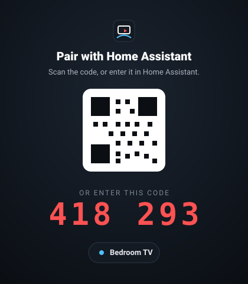
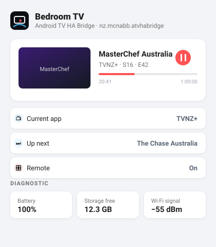
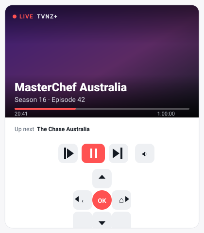

<div align="center">


<br>

**Now-playing and native control for Android TV / Google TV, inside Home Assistant — 100 % local. No ADB, no cloud, no account.**

[](LICENSE)
[](https://github.com/hacs/integration)
[](https://github.com/CyborgFingers/android-tv-ha-bridge/releases)
[](https://www.home-assistant.io/)

[](https://my.home-assistant.io/redirect/hacs_repository/?owner=CyborgFingers&repository=android-tv-ha-bridge&category=integration)

Made by **Josh McNabb** · [@CyborgFingers](https://github.com/CyborgFingers) · [Website](https://cyborgfingers.github.io/android-tv-ha-bridge/)

| Pairing on the TV | Device in Home Assistant | The TV frame card |
| :---: | :---: | :---: |
|  |  |  |

</div>

---

## ✨ Features

- **What's playing, properly.** Title, series / episode, poster, position and duration, playback state and the current app — straight from the TV, pushed to Home Assistant the moment it changes.
- **Titles even for apps that hide them.** Reads the Android TV *Watch Next* row (the data behind the launcher's *Continue watching*) to recover show, episode and poster for apps that publish no media metadata at all — TVNZ+ and ThreeNow, for example.
- **Native control, no ADB.** Play / pause / stop / next / previous / seek and volume through Android's `MediaController`; D-pad, OK, Back and Home through a tiny Accessibility service; app launch and deep links through intents.
- **Plug-and-play pairing.** The app advertises itself over mDNS, Home Assistant discovers it, you type the 6-digit code (or scan the QR) shown on the TV. Multiple TVs, each its own device.
- **Encrypted local API.** TLS 1.3 with the TV's certificate fingerprint pinned at pairing, plus a paired token. Nothing leaves your LAN.
- **Device sensors.** Current app, up next, battery, free storage and memory, volume, network type, IP, Wi-Fi SSID and signal, last boot.
- **Ad awareness.** When a player reports an ad, the `media_player` says so (`is_ad`, `ad_skippable`, `ad_skip_in`).
- **A card that ships with it.** The *TV frame* Lovelace card is registered automatically — poster, live progress, up-next and controls, no resource setup.

## 🧠 How it works

One Android TV app plus one Home Assistant integration. The app runs on the TV, reads what's playing, and exposes it — together with native control — over a local API. Home Assistant discovers the TV, you pair with a code, and every box becomes a proper HA device.

No developer options, no ADB keys, no root, no account with anyone. The app gets its abilities through three normal Android permission prompts, and everything stays on your network.

### Now-playing, read two ways

1. **MediaSession** — the standard Android media API. Title, artist, artwork, position / duration and playback state, straight from the player. Works for most media apps.
2. **Watch Next** — the Android TV *Watch Next* provider, the same local data behind the Google TV launcher's *Continue watching / Up next* row. The app reads it to recover the **show, episode and poster** for apps that publish **no media metadata at all**.

That second path is the standout. Apps that are a black box to every other integration still show up in Home Assistant with the right show, the right episode and the right poster.

### Control, 100 % native

| Action | How the app does it |
| --- | --- |
| Play / pause / stop / next / previous / seek / volume | `MediaController` transport controls |
| D-pad, OK, Back, Home | A small Accessibility service. It sends keys; the only thing it reads is the player overlay's time / title labels, and only for apps that publish no media metadata (see [App compatibility](#-app-compatibility)) |
| Launch apps / deep links | Android intents |

### Discovery, pairing & security

- The app advertises `_atvhabridge._tcp` over **mDNS**, so Home Assistant finds it automatically (manual host / port entry works too).
- Pair with the **6-digit code / QR** shown on the TV, then name the device (e.g. *Bedroom TV*).
- The API is **TLS** with a self-signed certificate whose **SHA-256 fingerprint is pinned at pairing**; every request carries the **paired token**. State is **pushed** over a WebSocket, so Home Assistant is never polling.

## 🏠 What you get in Home Assistant

Each paired TV is its own device. For a TV named **Bedroom TV**:

| Entity | What it does |
| --- | --- |
| `media_player.bedroom_tv` | State, `media_title`, `media_series_title`, episode, position / duration, poster (`entity_picture`), current app, up-next picks (`up_next_list`, with posters — next episodes first, never what's already playing) and ad attributes. Play / pause / stop / next / previous / seek, volume, turn on / off, `play_media` (launch an app, or play an up-next pick). |
| `remote.bedroom_tv` | `remote.send_command` — D-pad, OK, Back, Home, and `launch:<package>` to open an app. |
| `sensor.bedroom_tv_current_app` · `sensor.bedroom_tv_up_next` | The foreground app and what's up next. |
| Diagnostics | Battery, storage free, memory free, volume, network, IP address, Wi-Fi SSID, Wi-Fi signal, last boot. |

Because it's a standard `media_player`, everything you already know just works:

```yaml
automation:
  - alias: "Pause the bedroom TV when the doorbell rings"
    triggers:
      - trigger: state
        entity_id: binary_sensor.front_doorbell
        to: "on"
    conditions:
      - condition: state
        entity_id: media_player.bedroom_tv
        state: playing
    actions:
      - action: media_player.media_pause
        target:
          entity_id: media_player.bedroom_tv
```

## 🃏 The TV frame card

Ships with the integration and is **registered automatically** — no manual resource setup. Poster, title / episode, live progress bar, current-app badge, up-next, transport controls and a D-pad.

```yaml
type: custom:androidtv-ha-bridge-card
entity: media_player.bedroom_tv
# optional:
# name: Bedroom TV
# controls: false          # hide transport + D-pad
# remote_entity: remote.bedroom_tv
# up_next_entity: sensor.bedroom_tv_up_next
```

The `remote` and up-next entities are found automatically from the device — you only have to set `entity`.

## 📱 App compatibility

What Home Assistant sees depends on what the app publishes. Most players expose a standard Android **MediaSession** and just work. Apps that publish nothing are **recovered** instead: show, episode and poster from the Android TV *Watch Next* row, position and paused / playing from the player's own on-screen labels (read by the Accessibility service). Navigation and app launch work for every app.

| App | Now-playing (title · art · progress) | Season / episode | Play / pause · transport | Notes |
| --- | --- | --- | --- | --- |
| **Jellyfin — patched build** | ✅ Live (MediaSession) | ✅ Live | ✅ Native | Title, series, season / episode, position, poster and real play / pause, straight from the player. Needs the [`video-media-session` branch of `CyborgFingers/jellyfin-androidtv`](https://github.com/CyborgFingers/jellyfin-androidtv/tree/video-media-session) — see below. |
| **Jellyfin — stock** | ⚠️ Recovered (Watch Next + player overlay) | ⚠️ Recovered | ❌ Play / pause from HA doesn't reach the player · D-pad / OK / Back / Home work | Stock Jellyfin publishes **no MediaSession for video** (state `NONE`, no metadata), so there is no live session to read. |
| YouTube · SmartTube | ✅ Live (MediaSession) | — | ✅ Native | Ad awareness: `is_ad`, `ad_skippable`, `ad_skip_in`. |
| Plex · Spotify · VLC · Kodi · most ExoPlayer apps | ✅ Live (MediaSession) | If published | ✅ Native | Any app with a standard MediaSession. Season / episode only when the app numbers its items (disc / track). |
| TVNZ+ · ThreeNow | ⚠️ Recovered (Watch Next + player overlay) | ⚠️ Recovered | App-dependent · D-pad / OK / Back / Home work | No media metadata at all. Show, episode and poster appear once the show is in the launcher's *Continue watching* row. |
| Netflix · Prime Video | State · progress · app name | — | ✅ Via its MediaSession | They restrict metadata. |
| Any other app | State + app name if it publishes a MediaSession; nothing if it doesn't | — | Navigation + launch always; transport when it has a session | [Report what you see](https://github.com/CyborgFingers/android-tv-ha-bridge/issues) — compatibility notes are the most useful issue you can open. |

**Live** = read straight from the app's MediaSession, the moment it changes. **Recovered** = pieced together from Watch Next and the on-screen player: the right show and episode, but not a live feed.

> **Jellyfin, explained.** The stock Jellyfin Android TV app publishes **no MediaSession while playing video** — upstream [PR #5735](https://github.com/jellyfin/jellyfin-androidtv/pull/5735), which would have added one, was never merged. Out of the box the bridge therefore recovers show / episode / poster from the Watch Next row and reads position and paused / playing off the player's overlay: good, but not live, and Home Assistant's play / pause can't reach the player. The [`video-media-session`](https://github.com/CyborgFingers/jellyfin-androidtv/tree/video-media-session) branch of `CyborgFingers/jellyfin-androidtv` (a port of #5735 plus full metadata) adds a real video MediaSession — title, series, season / episode, position, poster, honest playback state. Install that build and the bridge picks the session up automatically; nothing to configure.

### Tested apps

Confirmed on a real Android TV box by the author:

- **Jellyfin (patched build)** — full live now-playing end-to-end: title, series, season / episode, position, poster, play / pause. Built from [`CyborgFingers/jellyfin-androidtv` @ `video-media-session`](https://github.com/CyborgFingers/jellyfin-androidtv/tree/video-media-session).
- **Jellyfin (stock)** — recovered: state, progress, show / episode / poster from Watch Next. No live session.
- **TVNZ+** and **ThreeNow** — recovered from Watch Next.
- **YouTube** — live now-playing via MediaSession, with ad awareness.

Everything else in the table is expected to work by the mechanism listed but hasn't been verified by the author — please [open an issue](https://github.com/CyborgFingers/android-tv-ha-bridge/issues) with what you see, good or bad.

## 🚀 Install

### 1 · The app, on your TV

Install **Android TV HA Bridge** on your Android TV / Google TV device, open it, and follow the on-screen steps to grant the three permissions.

> **Not on Google Play yet?** Download the latest **signed APK** from the [Releases](https://github.com/CyborgFingers/android-tv-ha-bridge/releases/latest) page and sideload it. On Android TV the simplest way is the **Downloader** app (AFTVnews) — enter the release URL — or run `adb install android-tv-ha-bridge-vX.Y.Z.apk` from a computer.

| Permission | Why |
| --- | --- |
| Notification access | Read the active MediaSession (what's playing) |
| TV info (`READ_TV_LISTINGS`) | Read the Watch Next row |
| Accessibility | Send D-pad / OK / Back / Home |

### 2 · The integration

**HACS (recommended)** — click the button:

[](https://my.home-assistant.io/redirect/hacs_repository/?owner=CyborgFingers&repository=android-tv-ha-bridge&category=integration)

or in HACS → **Integrations** → ⋮ → **Custom repositories**, add `https://github.com/CyborgFingers/android-tv-ha-bridge` with category **Integration**, then install **Android TV HA Bridge** and restart Home Assistant.

**Manual** — copy `custom_components/androidtv_ha_bridge/` into your Home Assistant `config/custom_components/` folder and restart.

### 3 · Pair

Home Assistant discovers the TV → **Configure** → enter the 6-digit code shown on the TV → name it. Done. Repeat steps 1 and 3 for every TV.

## 🔐 Privacy

**100 % local.** No cloud, no account, no telemetry. The app only talks to Home Assistant on your LAN — encrypted, fingerprint-pinned, token-authenticated.

## 🛠️ For developers

The data is exposed generically — a Home Assistant event you can subscribe to from another integration, plus a small documented local API (`/api/info`, `/api/pair`, `/api/state`, `/api/command`, `/api/apps` and a WebSocket that pushes the full state). See [PROTOCOL.md](PROTOCOL.md).

Brand assets (logo, icon, palette, type) live in [`branding/`](branding/BRAND.md).

| Path | What's in it |
| --- | --- |
| `android/` | The Android TV app (`nz.mcnabb.atvhabridge`) |
| `custom_components/androidtv_ha_bridge/` | The Home Assistant integration (domain `androidtv_ha_bridge`) and the bundled TV frame card |
| `docs/` | The [website](https://cyborgfingers.github.io/android-tv-ha-bridge/) (GitHub Pages) |
| `branding/` | Logo, icon, hero and the brand guide |

## 🤝 Contributing

Issues and pull requests are welcome — bug reports, app-compatibility notes and translations especially. Want to make a bigger change? Open an issue first to talk it through.

## 📄 License

[GNU General Public License v3.0](LICENSE) — free to use, modify and redistribute; any derivative work must remain open-source under the same license. © 2026 Josh McNabb.

Copyright © 2026 **Josh McNabb**. *Android TV* and *Google TV* are trademarks of Google LLC; *Home Assistant* is a trademark of the Open Home Foundation. This project is not affiliated with either.
